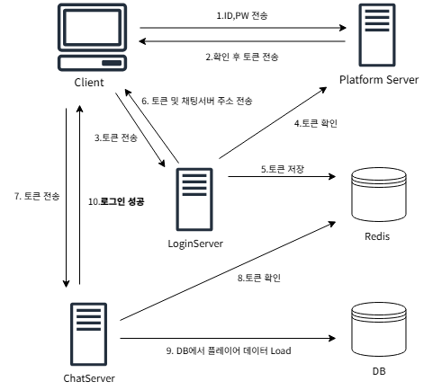

<h1>프로젝트 구조</h1>
<ul>모든 서버는 물리적 분산이 가능할 수 있도록 설계했습니다.</ul>
 

 
 
<h3>NetWorkLib</h3>
<ul>다른 프로젝트의 네트워크 부분을 담당하는 네트워크 라이브러리입니다.</ul>
<ul>개발 과정에서 네트워크 라이브러리와 컨텐츠를 동시에 수정하는 경우가 빈번해서 편의성을 위해 빌드 종속성을 이용해 하나의 솔루션에 함께 관리했습니다.</ul>
<ul>동기화 객체를 사용하지 않고 멀티쓰레드 문제를 전부 인터락으로 해결했습니다.</ul>
<ul>성능 향상을 위한 목표보다는 동시성 문제를 경험하고 해결해나가는 과정에 초점을 두었습니다.</ul>
<ul>IOCP 모델을 사용했으며 정적 라이브러리로 빌드해 다른 프로젝트에서 사용하고 있습니다.</ul>
<ul>컨텐츠에선 On~ 식의 핸들러 함수를 등록해 사용하는 방식으로 구현되었습니다.</ul>
 
 
 

<h3>ChatSingleServer</h3>
<ul>컨텐츠 부분을 담당하는 싱글 쓰레드로 구현된 채팅 서버입니다.</ul>
<ul>섹터 처리를 기반으로 주변 클라이언트에 메세지를 뿌려주고 있습니다.</ul>
<ul>섹터의 이동 방식은 현재 서버에서 실제로 캐릭터 이동 시작, 정지 메세지를 받고 직접 섹터 이동처리를 하고 있습니다.</ul>
 
 
 

<h3>ChatMultiServer</h3>
<ul>위의 채팅 서버의 멀티 쓰레드 버전입니다</ul>
<ul>컨텐츠의 멀티 쓰레드화를 위해서 섹터 한 칸에 대한 락을 잡게 되었습니다.</ul>
<ul>멀티 쓰레드 버전에선 클라이언트에서 섹터 이동 결과를 보내주면 서버에서 받아서 동기화 해주는 방식으로 이동처리가 되고 있습니다.</ul>
<ul>클라이언트는 로그인 서버를 경유해서 오기 때문에 Redis에 접근해서 토큰을 확인하는 로직이 포함되어 있습니다.</ul>
 
 
 

<h3>LoginServer</h3>
<ul>채팅, 게임 서버에 입장하기 전 로그인 과정을 거치는 서버입니다.</ul>
<ul>로그인 서버에서 Redis에 승인 된 클라이언트에 대한 토큰을 저장하고 채팅, 게임 서버에서 토큰을 확인하는 방식입니다.</ul>
<ul>로그인 승인으로 판단 되면 클라이언트에 키, 토큰 + 접속 할 서버의 ip, port 정보를 전달합니다.</ul>
 
 
 

<h3>MonitoringServer</h3>
<ul>서버의 상태를 확인하기 위한 모니터링 데이터를 릴레이 하는 서버입니다.</ul>
<ul>연결 구조를 단순화 시키기 위해서 존재합니다.</ul>
<ul>연결 된 모든 서버의 모니터링 데이터를 받고 그걸 모니터링 클라이언트에 보내주는 방식입니다.</ul>
<ul>장기적인 모니터링 데이터를 관찰하기 위해 MySql DB에 일정 주기로 모니터링 log를 저장합니다.</ul>
 
 
 

<h3>DummyClient</h3>
<ul>싱글 쓰레드 채팅 서버의 로직을 검증하기 위한 더미 프로그램입니다</ul>
<ul>섹터 처리에 대한 검증을 위해 trust모드가 있습니다</ul>
<ul>이 모드에선 로직이 단계별로 진행 됩니다. (메세지 송신, 수신, 수신 전체 확인, 연결 종료)</ul>
 
 
 
*release/64비트환경/최적화 옵션 꺼놓은 상태에서 빌드해주시면 됩니다.

감사합니다.
